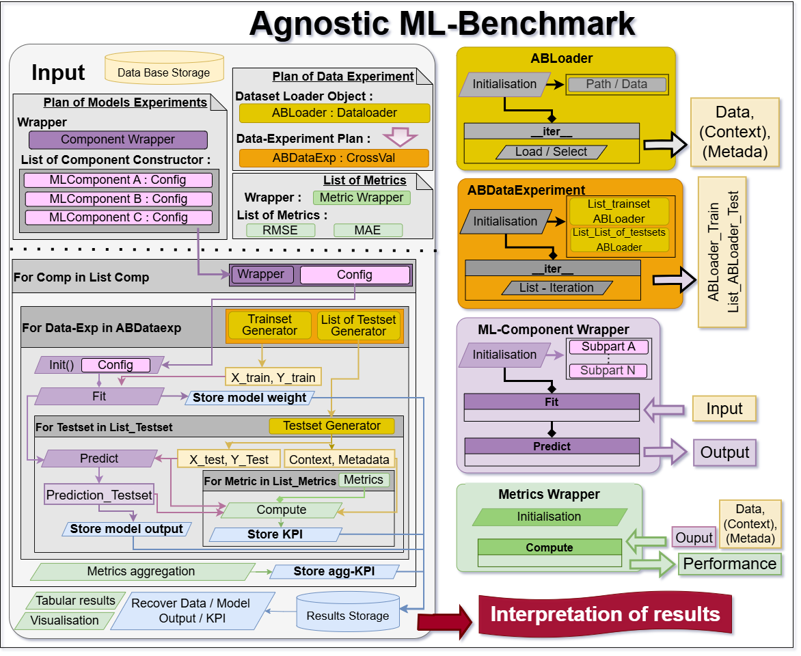

# CTM Project: Towards An Open Source Benchmarking Framework to Secure V2X Perception In Intersections

## Project Link
https://www.irt-systemx.fr/en/projet/ctm/

## 📘 Overview

This project aims to evaluate and compare machine learning components under reproducible, standardized conditions.

**Main objective:**  
[AI-based methods benchmarking for misbehavior detection]

---

## **Architecture Overview**



Abench’s architecture is organized around modular encapsulators:

1. **Dataloader** – provides data access and preprocessing  
2. **Component** – encapsulates model submodules  
3. **Modeling Pipeline** – defines data-to-output transformations  
4. **Evaluation / Visualization** – executes metrics and aggregates results

Each component is **agnostic** to task-specific logic, making Abench adaptable to various use cases.

---


## 🧠 Structure Overview

The project follows the standard **Abench project layout**:

```
Project_name/
 └──benchmark/
    ├── data/
    │   └── raw/                  # Raw input data
    │
    ├── src/
    │   ├── descriptor.py         # [Describe metadata generation process]
    │   ├── perturbator.py        # [Describe data perturbation logic]
    │   ├── dataloader.py         # [Describe data loading class or type (ImageLoader, TimeSeriesLoader...)]
    │   ├── component.py          # [Describe ML component or wrapper used]
    │   ├── metrics.py            # [List metrics computed]
    │   └── [TODO: optional additional modules]
    │
    ├── benchmark.py              # Main experiment loop using Abench Benchmark class
    ├── Data_management.ipynb              # Main experiment loop using Abench Benchmark class
    ├── analysis.ipynb            # Notebook for visualization and metrics aggregation
    └── Results/                  # Auto-generated output folders
        ├── src_data/ # Folder by Dataloader with the dataloader + pickle of components_name_list, Data_experiment objectfs testset_name_list and trainset_name_list 
        ├── dictperf.p / # Pickle of results containing a dict of metrics.
        ├── Trainset A/
        │   ├──Folder by Modelname
        │      ├── Component # Model save
        |      ├── Folder by Test_set  # output.p : model output save as pickle object and dictperf.py metrics computed for TestSets 
        └── Trainset B/
 └──Preprocess/
    ├── data/
    │   └── rawdata/              # [Sensors' raw data]
    │   └── map/                  # [Map data]
    ├── lib/                      # [Preprocessing lib]
    ├── gen_data.ipynb            # Generate the proprocessed data
    ├── data_split.ipynb          # data spliting
```

---

## 🧱 Components

### 🔹 DataLoader
- **Class:** [TODO: class name, e.g., ImageDataLoader or TimeSeriesDataLoader]  
- **Input type:** [TODO: CSV / image folder / synthetic dataset …]  
- **Description:**  
  [TODO: explain what kind of data this loader manages, preprocessing applied, and output format.]

---

### 🔹 Component (Model Wrapper)
- **Class:** [TODO: class name, e.g., RegressionWrapper, CNNWrapper, TransformerWrapper]  
- **Encapsulated model:** [TODO: base model or framework used (e.g., sklearn, torch, xgboost)]  
- **Interface:** follows Abench `Component` API (`fit`, `predict`).  
- **Description:**  
  [TODO: describe model structure or pipeline steps.]

---

### 🔹 Metrics
- **Classes:** [TODO: list of EncapsulatedMetrics used]  
- **Description:**  
  [TODO: specify what each metric measures (performance, trust, uncertainty, etc.)]  
- **Conditional metrics:** [TODO: describe conditional metrics logic if any]

---

## ⚙️ Execution

### Run benchmark
```bash
python benchmark.py
```
This will:
- Load data via the defined `DataLoader`
- Train/evaluate components using the Abench execution loop
- Save outputs in the `results/` folder

### Optional: Run on SLURM cluster
```bash
sbatch benchmark.slurm
```

---

## 📊 Analysis

Open the provided notebook to visualize aggregated metrics:

```bash
jupyter notebook Analyse_benchmark.ipynb
```
> The notebook demonstrates metric aggregation, visualization, and comparison of model behaviors.

---

## 📦 Requirements

Install Abench and required dependencies:

```bash
pip3 install -r requirements.txt
pip3 install abench-1.0.5-py3-none-any.whl
pip3 install uqmodels-1.1.1-py3-none-any.whl
```
> [TODO: list specific dependencies if any, e.g., torch, xgboost, pandas, etc.]

---

## 🧩 Example Metadata

| Field | Description |
|-------|--------------|
| **Task** | [TODO: e.g., regression / classification / forecasting] |
| **Dataset** | [TODO: dataset name or source] |
| **Metrics** | [TODO: list main metrics] |
| **Components** | [TODO: model wrappers or baselines compared] |
| **Perturbations** | [TODO: if applicable, describe data perturbations used] |

---

## 🧾 Notes

- All Abench results (data, models, outputs, metrics) are automatically stored in the `results/` folder.
- The project can be extended by defining additional wrappers or metrics in the `src/` directory.
- Due to the large volume of data and the constraints of the double-blind review process, we provid only a portion of our data in 'benchmark/data/' folder. We will release all the data at a later stage.

---

## 📚 References

> {**IEEE ITSC2026**: *Towards An Open Source Benchmarking Framework to Secure V2X Perception In Intersections*, Zhang et al.}

---

## 👤 Author(s)

- **Maintainer:** 
  - Jiahao.ZHANG, jiahao.zhang@irt-systemx.fr  
  - Kevin.PASINI, kevin,pasini@irt-systemx.fr
- **Contributors:** [TODO: optional]
